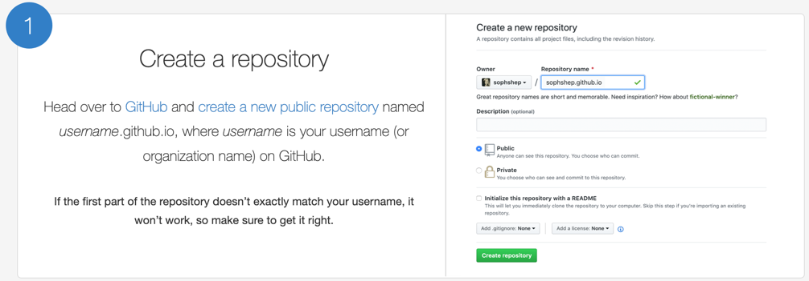
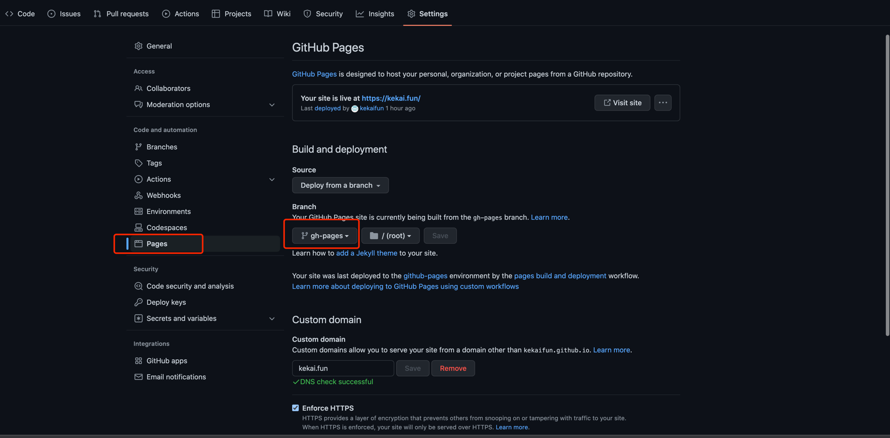

今天使用Hugo搭建了[我的个人博客](https://kekai.fun)，并在GitHub Pages上免费托管。Hugo使用起来非常简单，整个网站搭建耗时不到30min.
<!--more-->

## 为什么使用Hugo
1. hugo生成静态网站，可托管在cdn,oss,github,gitlab等很多地方，部署方便。
2. 相比于动态网站，安全性更高，访问速度更快。因为访问内容都已经提前渲染好放在html中
3. 有比较成熟社区，不仅可以用来搭建个人博客，也能用来搭建其他网站。
4. hugo是使用go编写的，本人使用go技术栈，不仅方便排查问题，也可以学习hugo很多设计理念。

## 安装Hugo

注意，Hugo有两个版本：标准版(Standard)和扩展版(Extended)，默认我们使用Extended Hugo。 可参考[官方文档](https://gohugo.io/installation/).

*Extended Hugo能够向前兼容Standard Hugo, 即使用Extended Hugo也能生成和部署Standard Hugo编写的网页。
反之则不行，因此我们默认使用Extended Hugo*


## 生成个人网站

1. 执行以下命令,生成网站
```shell
# hugo项目初始化,username替换成你自己github账户名
hugo new site username.github.io
# 进入项目根目录
cd username.github.io
# git项目初始化
git init
# 将Ananke主题clone到项目中
git submodule add https://github.com/theNewDynamic/gohugo-theme-ananke themes/ananke
# 使用ananke主题
echo "theme = 'ananke'" >> config.toml
# 启动hugo服务，打开返回网址即可查看主页
hugo server
```

2. 添加博客
```shell
# 创建文章
hugo new posts/my-first-post.md
```

3. 默认内容如下
```markdown
---
title: "My First Post"
date: 2023-1-20T09:03:20-08:00
draft: true
---
## Introduction

This is **bold** text, and this is *emphasized* text.

Visit the [Hugo](https://gohugo.io) website!
```
title: 文章主题

date: 文章编写日期

draft: 代表草稿，Hugo默认不会发布draft为true的文章。文章编写好后，可将draft设置为false.


你可以使用markdown格式继续编辑你的文章。

4. 配置你的网站
```toml
baseURL = 'https://username.github.io/'
languageCode = 'en-us'
title = 'My New Hugo Site'
theme = 'ananke'
```
打开你的hugo项目配置文件，baseURL替换成你网站正式域名,以斜杠结尾。因为我们是托管在github pages上，
我们使用github pages网站域名，**记得将username替换成你自己的github账户名**。

5. 预览网站
```shell
hugo server -D
```

## 部署网站到GitHub Pages
[GitHub Pages](https://pages.github.com/)提供免费的静态网页托管服务。你只需要编辑你的文章，将生成的静态网页放在github仓库中，
即可实时查看你的网页变化。

1. [创建一个GitHub项目](https://github.com/new)，项目名为username.github.io, username替换成你的GitHub账户名



2. 增加GitHub Actions, 在提交代码时，自动生成静态网站

```shell
name: github pages

on:
  push:
    branches:
      - main  # Set a branch that will trigger a deployment
      - master
  pull_request:

jobs:
  deploy:
    runs-on: ubuntu-22.04
    steps:
      - uses: actions/checkout@v3
        with:
          submodules: true  # Fetch Hugo themes (true OR recursive)
          fetch-depth: 0    # Fetch all history for .GitInfo and .Lastmod

      - name: Setup Hugo
        uses: peaceiris/actions-hugo@v2
        with:
          hugo-version: 'latest'
          extended: true

      - name: Build
        run: hugo --minify

      - name: Deploy
        uses: peaceiris/actions-gh-pages@v3
        if: github.ref == 'refs/heads/main'
        with:
          github_token: ${{ secrets.GITHUB_TOKEN }}
          publish_dir: ./public
```
以上workflow会在提交代码到main/master分支时，自动生成静态网页，并推送到gh-pages分支。

3. 设置GitHub Pages， 从gh-pages分支创建网站

4. 现在我们只需提交代码到master/main分支，即可触发GitHub Action，生成静态网页到gh-pages分支
```shell
# 进入项目根目录,username替换成你github账户名
cd username.github.io
# 将项目关联到github仓库，username替换成你github账户名
git remote add origin git@github.com:username/username.github.io.git
# 提交代码，即可触发生成主页
git add .
git commit -m "my website"
git push origin master
```

5. 访问https://username.github.io, 即可访问你的个人主页

6. 假设你拥有域名username.com, 你也可以设置username.com作为你的项目域名。
```shell
# 进入项目根目录,username替换成你github账户名
cd username.github.io
mkdir static
echo "username.com" > static/CNAME
git add .
git commit -m "add CNAME"
git push origin master
```
此时，打开https://username.com即可访问你的网站主页.


